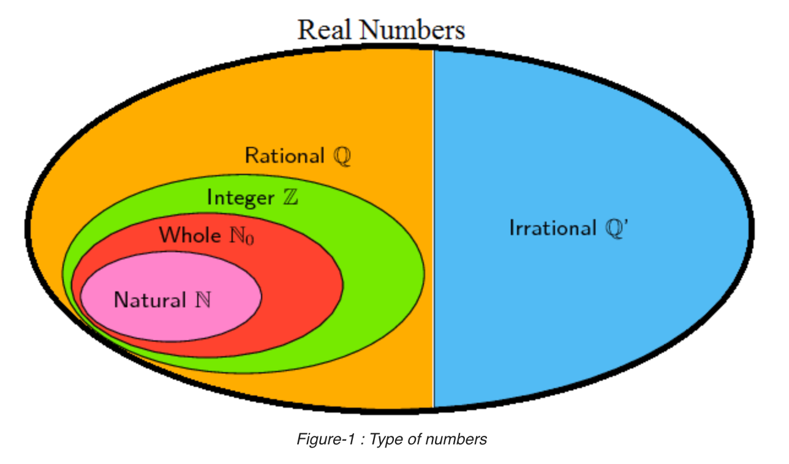

```{r setup, eval=TRUE, echo=FALSE, warning=FALSE, message=FALSE}
require(reticulate)
```

```{python, eval=TRUE, echo=FALSE, results="asis", warning=FALSE, message=FALSE}
sys.path.append('../../../assets/python')

from ctns_make  import ctns_make  as CTNS_MAKE
from ctns_build import ctns_build as CTNS_BUILD
```

```{python, eval=FALSE, results="asis", echo=FALSE, warning=FALSE, message=FALSE}
# Start with creating each flashcard individually.
m_list = [
    'NT_CompS'
  , 'NT_EvenS'
  , 'NT_IntS'
  , 'NT_IrrS'
  , 'NT_NatS'
  , 'NT_OddS'
  , 'NT_RadS'
  , 'NT_RatS'
  , 'NT_RealS'
  , 'NT_TransS'
  , 'NT_WholeS'
  #, 'NT_rational_functionQ1_1'
  #, 'NT_rational_functionQ1_2'
  #, 'NT_rational_functionQ1_3'
]

for m in m_list:
    CTNS_MAKE(match=m)
    CTNS_BUILD(match=m, id=m, preview=True, image_target=m, encrypt=False, opt_ctns = [ 
        "flashcard"
      , "quiz_container_css='width:100%;'"
       ])
```

## Natural Numbers

The simplest of our number types is the set of **Natural Numbers** $\mathbb{N}$,

\begin{equation}
\mathbb{N} = \{1, 2, 3, ...\},
\end{equation}

which is also known as the set of **counting numbers**. Everyone uses Natural Numbers every day for counting--there are 3 sheep in the field--and for ordering, as in No. 1, No. 2, No. 3, and so forth.

```{r, echo=FALSE}
blogdown::shortcode_open("spoiler", text="<strong>More on Natural Numbers</strong>", .type="html")
```

Recognizing Natural Numbers is easy: you see them everywhere. 

The trick is to know whether your teacher includes ZERO -- the symbol for nothing -- in the set of Natural Numbers. Some do, some do not.

Ask your teacher: Does the set of Natural Numbers include ZERO? Yes or No?

I do not include ZERO in the set of Natural Numbers because the notion of ZERO -- the symbol for nothing -- is a recent creation when compared to counting numbers.

```{r, echo=FALSE}
blogdown::shortcode_close("spoiler", .type="html")
```

```{r eval=TRUE, echo=FALSE}
blogdown::shortcode('NT_NatS')
```

----

## Whole Numbers

The set of **Whole Numbers** is the number zero combined with the set of Natural Numbers $\mathbb{N}$,

\begin{equation}
\text{whole numbers} = \{0, 1, 2, 3, ...\}
\end{equation}

```{r eval=TRUE, echo=FALSE}
blogdown::shortcode('NT_WholeS')
```

----

## Integers

The set of Integers is the number zero combined with the set of Natural Numbers and their opposites,

\begin{equation}
\mathbb{Z} = \{..., -3, -2, -1, 0, 1, 2, 3, ...\}
\end{equation}

```{r, echo=FALSE}
blogdown::shortcode_open("spoiler", text="<strong>More on Integers</strong>", .type="html")
```
Most likely, you will encounter integers in your homework assignment. That said, pay special attention to whether your teacher says limit your answer to the set of Integers $\mathbb{Z}$.

For example, support your teacher asks you for the range of integer values $x$ that satisfy the inequality,

\begin{equation}
-2 \le x \le 4.
\end{equation}

The correct answer is the set of values,

\begin{equation}
x \in {-2, -1, 0, 1, 2, 3, 4}
\end{equation}

The value of one-and-a-half ($1/2$) is not in the correct answer set.
```{r, echo=FALSE}
blogdown::shortcode_close("spoiler", .type="html")
```

```{r eval=TRUE, echo=FALSE}
blogdown::shortcode('NT_IntS')
```

----

## Rational Numbers

The set of **Rational Numbers** $\mathbb{Q}$ is the set of fractional numbers $p/q$ where $p,q$ are integers, divide by zero excepted,

\begin{equation}
\mathbb{Q} = \{ p/q \ |\  p,q \in \mathbb{Z}, q \ne 0 \}
\end{equation}

```{r eval=TRUE, echo=FALSE}
blogdown::shortcode('NT_RatS')
```

----

```{r google-accounts, echo=FALSE, fig.cap="Organizing Number Types as related groups.", out.width=400}

```


```{r eval=FALSE, echo=FALSE}

# Now show each flashcard individually, as proof
# positive that everything looks good.
#blogdown::shortcode('quiz_set_1', location='1321')

blogdown::shortcode('NT_CompS')
blogdown::shortcode('NT_EvenS')
blogdown::shortcode('NT_IntS')
blogdown::shortcode('NT_IrrS')
blogdown::shortcode('NT_NatS')
blogdown::shortcode('NT_OddS')
blogdown::shortcode('NT_RadS')
blogdown::shortcode('NT_RatS')
blogdown::shortcode('NT_RealS')
blogdown::shortcode('NT_TransS')
blogdown::shortcode('NT_WholeS')
#blogdown::shortcode('NT_rational_functionQ1_1')
#blogdown::shortcode('NT_rational_functionQ1_2')
#blogdown::shortcode('NT_rational_functionQ1_3')
```


```{python, eval=FALSE, results="asis", echo=FALSE, warning=FALSE, message=FALSE}
# When creating a quiz set, I am using m_list directly
# along with target (not match).
m_list = [
    'LF_GeneralFormS'
  , 'LF_HLineS'
  , 'LF_InterceptInterceptFormS'
  , 'LF_InterceptS'
]

CTNS_MAKE(target=m_list)
CTNS_BUILD(target=m_list, id='quiz_set_1', write_image=False, encrypt=False, opt_ctns = [ 
    "flashcard_quiz"
])

# When creating a quiz set, I am using m_list directly
# along with target (not match).
m_list = [
    'LF_PaLineS'
  , 'LF_PeLineS'
  , 'LF_PointSlopeFormS'
  , 'LF_SlopeFormulaS'
]

CTNS_MAKE(target=m_list)
CTNS_BUILD(target=m_list, id='quiz_set_2', write_image=False, encrypt=False, opt_ctns = [ 
    "flashcard_quiz"
])
```


```{r eval=FALSE, echo=FALSE}
blogdown::shortcode('quiz_set_1')
blogdown::shortcode('quiz_set_2')
```

```{r, echo=FALSE}
blogdown::shortcode_open("spoiler", text="<strong>Easter Egg: Markdown Example</strong>", .type="html")
```

```{r eval=FALSE, echo=FALSE}
blogdown::shortcode('quiz_set_2')
```

```{r, echo=FALSE}
blogdown::shortcode_close("spoiler", .type="html")
```
