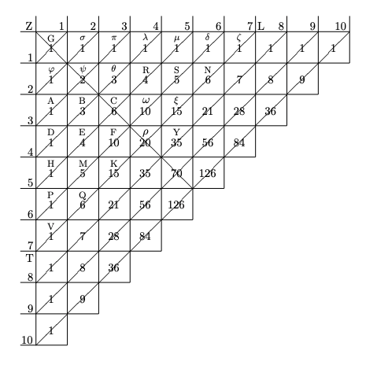

Pascal's Triangle organizes the binomial coefficients in a triangular stack with one row of coefficients stacked upon another. While simple in both form and construction, Pascal's Triangle contains a wealth of patterns in combinatorics.

Pascal's Triangle with six rows, for example, is the triangular array
```{python, results='asis', echo=FALSE}
import my_latex as ML
print(ML.pascals_triangle(6))
```
where each value $(n,k)$ for row $0 \le n \lt 6$ and column $0 \le k \le n$ equals the combination

\begin{equation}
{n \choose k} = \frac{n!}{k!(n-k)!}.
\end{equation}

An interesting pattern within Pascal's Triangle, for example, is the hockey stick pattern where the sum of the values along the hockey stick equals value of its base. The sum of the values $\greenbox{1}, \greenbox{2}, \greenbox{3}, \greenbox{4}$ along the stick equals $\bluebox{10}$ at the base, as shown below.

```{python, results='asis', echo=FALSE}
print(ML.pascals_triangle(6,
    highlight=[(1,1,'green'), 
               (2,1,'green'),
               (3,1,'green'),
               (4,1,'green'),
               (5,2,'blue')]))
```


```{r, echo=FALSE}
blogdown::shortcode_open("spoiler", text="Click to view: As taught in middle school", .type="html")
```

At an early age, math students learn about Pascal's Triangle and discover the many number patterns hidden within. Students learn early that constructing Pascal's Triangle is quite simple beginning with a triangle of ones $\bluebox{1}$.

```{python, results='asis', echo=FALSE}
print(ML.pascals_triangle(6,
    symbol=[(2,1), (3,1), (3,2), (4,1), (4,2), (4,3), (5,1), (5,2), (5,3), (5,4)],
    highlight=[(0,0,'blue'), 
               (1,0,'blue'), (1,1,'blue'),
               (2,0,'blue'), (2,2,'blue'),
               (3,0,'blue'), (3,3,'blue'),
               (4,0,'blue'), (4,4,'blue'),
               (5,0,'blue'), (5,5,'blue')]))
```

The students also learn that just inside the diagonal of one's, is the sequence of integers $1, 2, 3, 4, \text{and so forth}$.

```{python, results='asis', echo=FALSE}
print(ML.pascals_triangle(6,
    symbol=[(4,2), (5,2), (5,3)],
    highlight=[(1,0,'red'), (1,1, 'red'),
               (2,1,'red'),
               (3,1,'red'), (3,2,'red'),
               (4,1,'red'), (4,3,'red'),
               (5,1,'red'), (5,4,'red')]))
```

The students calculate the inside numbers as the sum of the two numbers above. For example, the sum of the two numbers $( \greenbox{1}+\greenbox{1} )$ yields the number $\bluebox{2}$ below.

```{python, results='asis', echo=FALSE}
print(ML.pascals_triangle(6, 
    symbol=[(3,1), (3,2), (4,1), (4,2), (4,3), (5,1), (5,2), (5,3), (5,4)],
    highlight=[(1,0,'green'), (1,1,'green'), (2,1, 'blue')]))
```

Students work quickly to fill in the values for Pascal's Triangle.

```{python, results='asis', echo=FALSE}
print(ML.pascals_triangle(6, 
    symbol=[(3,2),(4,1), (4,2), (4,3), (5,1), (5,2), (5,3), (5,4)],
    highlight=[(2,0,'green'), (2,1,'green'), (3,1,'blue')]))
```

```{python, results='asis', echo=FALSE}
print(ML.pascals_triangle(6, 
    symbol=[(4,1), (4,2), (4,3), (5,1), (5,2), (5,3), (5,4)],
    highlight=[(2,1,'green'), (2,2,'green'), (3,2,'blue')]))
```

```{python, results='asis', echo=FALSE}
print(ML.pascals_triangle(6, 
    symbol=[(4,2), (4,3), (5,1), (5,2), (5,3), (5,4)],
    highlight=[(3,0,'green'), (3,1,'green'), (4,1,'blue')]))
```

```{python, results='asis', echo=FALSE}
print(ML.pascals_triangle(6, 
    symbol=[(4,3), (5,1), (5,2), (5,3), (5,4)],
    highlight=[(3,1,'green'), (3,2,'green'), (4,2,'blue')]))
```

```{python, results='asis', echo=FALSE}
print(ML.pascals_triangle(6, 
    symbol=[(5,1), (5,2), (5,3), (5,4)],
    highlight=[(3,2,'green'), (3,3,'green'), (4,3,'blue')]))
```

```{python, results='asis', echo=FALSE}
print(ML.pascals_triangle(6, 
    symbol=[(5,2), (5,3), (5,4)],
    highlight=[(4,0,'green'), (4,1,'green'), (5,1,'blue')]))
```

```{python, results='asis', echo=FALSE}
print(ML.pascals_triangle(6, 
    symbol=[(5,3), (5,4)],
    highlight=[(4,1,'green'), (4,2,'green'), (5,2,'blue')]))
```

```{python, results='asis', echo=FALSE}
print(ML.pascals_triangle(6, 
    symbol=[(5,4)],
    highlight=[(4,2,'green'), (4,3,'green'), (5,3,'blue')]))
```

```{python, results='asis', echo=FALSE}
print(ML.pascals_triangle(6, 
    symbol=[],
    highlight=[(4,3,'green'), (4,4,'green'), (5,4,'blue')]))
```

When expanding a $3^{rd}$-order binomial, e.g., $(a+b)^3$, algebra students learn that the coefficients they need for this expansion come directly from their Pascal's Triangle.

```{python, results='asis', echo=FALSE}
print(ML.pascals_triangle(6, 
    symbol=[],
    highlight=[(3,0,'blue'), (3,1,'blue'), (3,2,'blue'), (3,3,'blue')]))
```

Namely, the students use the four numbers $\bluebox{1}, \bluebox{3}, \bluebox{3}, \bluebox{1}$ from row $n=3$ in their expansion,

\begin{aligned}
(a+b)^3 & = \  \bluebox{1}a^3 + \bluebox{3}a^2b + \bluebox{3}ab^2 + \bluebox{1}b^3 \\[1em]
        & = \  a^3 + 3a^2b + 3ab^2 + b^3.
\end{aligned}

```{r, echo=FALSE}
blogdown::shortcode_close("spoiler", .type="html")
```

The $n^{th}$ row in Pascal's Triangle is a sequence of combinations ${n \choose k}$ for $0 \le k \lt n$, for example

```{python, results='asis', echo=FALSE}
print(ML.pascals_triangle(6, equals="TRUE", combo="TRUE"))
```

```{r, echo=FALSE}
blogdown::shortcode_open("spoiler", text="Click to view: How Blaise Pascal viewed Pascal's Triangle", .type="html")
```

While Pascal's Triangle receives its name from the French mathematician Blaise Pascal (1623-1662), Pascal's Triangle has been extensively studied well before the efforts of Blaise Pascal. According to Pengelley [@Pengelley], Blaise Pascal studied his Pascal's Triangle in a form different from how we consider his triangle today. Namely, Pascal studied his triangle in rows and columns as shown in Figure \@ref(fig:pascals-triangle).

```{r pascals-triangle, echo=FALSE, fig.cap="Pascal's Triangle from Pascal's <br/>'Treatise on the Arithmetical Triangle'.", out.width=400}

```

Pascal considered his form as a generator of a triangle beginning with an arbitrary value placed in the top left-most position. For demonstration, Pascal set this arbitrary value to be one. According to Pascal [@Pengelley], 

> The number of the first cell, which is at the right angle, is arbitrary; but that number having been assigned, all the rest are determined, and for this reason it is called the generator of the triangle. Each of the others is specified by a single rule as follows:
>
> The number of each cell is equal to the sum of the numbers of the perpendicular and parallel cells immediately preceding. Thus cell F, that is, the number of cell F, equals the sum of cell C and cell E, and similarly with the rest.

As noted in Pascal's form of his triangle, a particular value, say $\bluebox{10}$, is determined as the sum of the two values, one immediately above and another immediately to its left, $(\greenbox{6} + \greenbox{4})$ in this example.

```{python, results='asis', echo=FALSE}
print(ML.pascals_triangle_by_pascal(10,
    highlight=[(4, 1, 'green'), (4, 2, 'green'), (5, 2, 'blue')]))
```

```{r, echo=FALSE}
blogdown::shortcode_close("spoiler", .type="html")
```

### References
