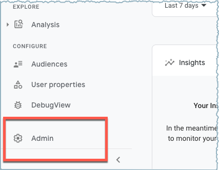

Wait on TAGS: ["Google Analytics", "Hugo-Academic"]

**Step 1. Log in to https://analytics.google.com.**

Go ahead, log into [Google Analytics](https://analytics.google.com). 

```{r google-accounts, echo=FALSE, fig.cap="Login screen for Google accounts.", out.width=400}
knitr::include_graphics("images/1-login.png")
```

I have two Google accounts: my original account and now my student account for UT Austin. I am using my original account for Google Analytics -- I suspect that I don't have a choice. When I am logging into my Google account, I make a point of using the correct Google account, my original account in this case.

----

Now that I have logged in, I am looking at the Google Analytics Dashboard, as shown in **Figure \@ref(fig:dashboard)**.

```{r dashboard, echo=FALSE, fig.cap="Google Analytics Dashboard", out.width="90%"}
knitr::include_graphics("images/2-dashboard.png")
```

**Step 2. Select Admin.**

I am selecting "Admin" located at the bottom left of my screen. This brings me to a panel that shows my account and my property.

```{r select-admin, echo=FALSE, fig.cap="Select Admin on the bottom-left.", out.width="70%"}

```

Selecting Admin brings me to the Admin Dashboard

```{r admin-dashboard, echo=FALSE, fig.cap="Admin Dashboard", out.width="90%"}
knitr::include_graphics("images/4-admin-dashboard.png")
```

I am going leave everything alone in regards the Account column, and instead focus on the panel for properties.

```{r create-property, echo=FALSE, fig.cap="Create Property Panel", out.width="90%"}
knitr::include_graphics("images/5-create-property.png")
```

Introducing the *new* Google Analytics

https://www.blog.google/products/marketingplatform/analytics/new_google_analytics/


Release dates ...

https://support.google.com/analytics/answer/9164320?hl=en

### References

http://cloudywithachanceofdevops.com/posts/2018/05/17/setting-up-google-analytics-on-hugo/

This post is dated May 17, 2018. That was 2 1/2 years ago. I am working from Deptawa's instructions [@Deptawa2018].
